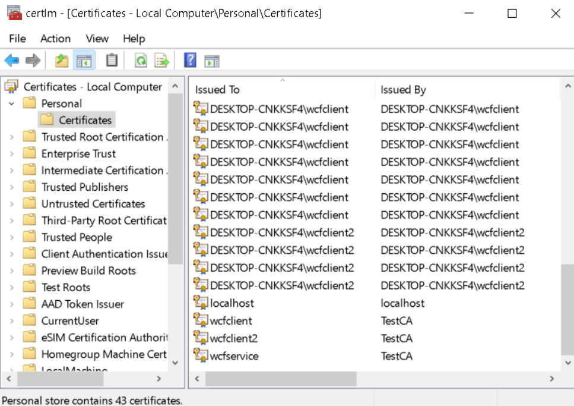
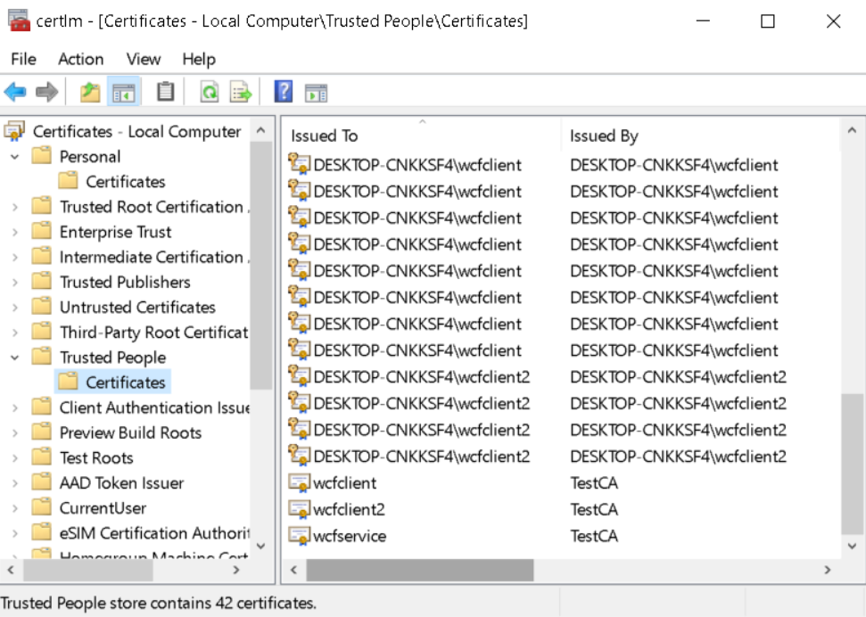
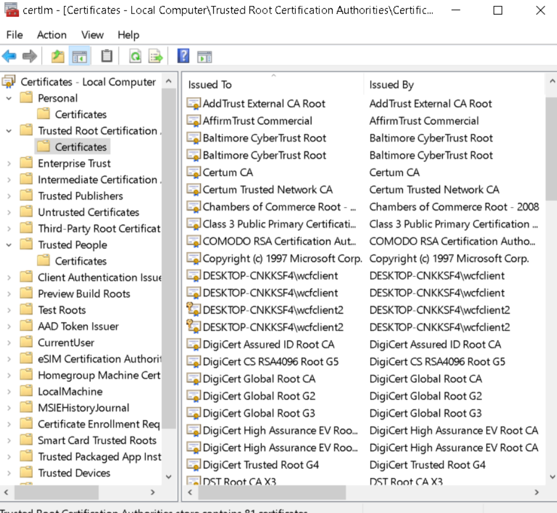
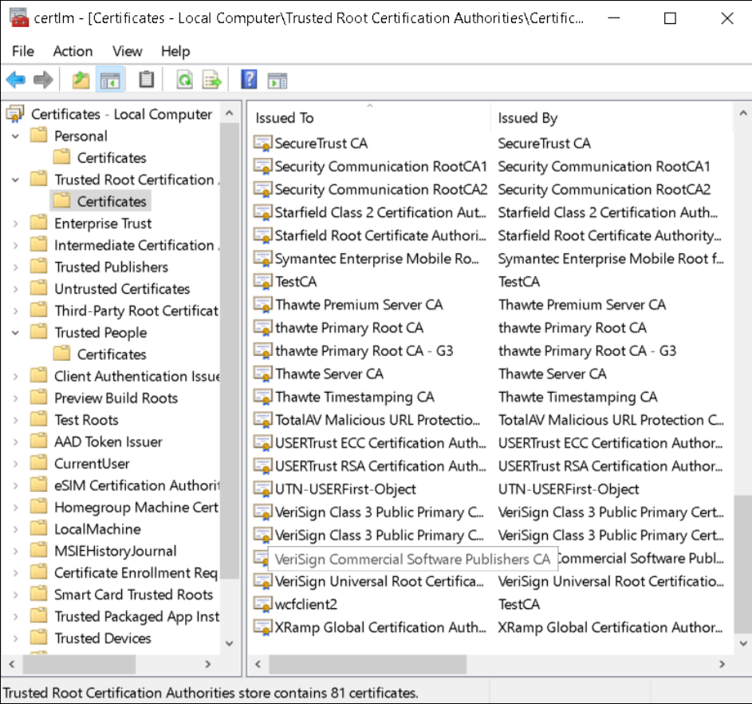
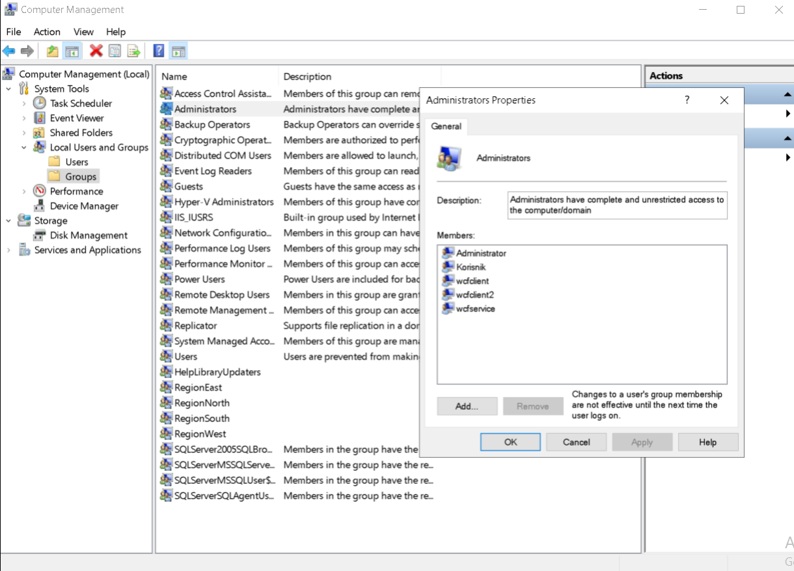
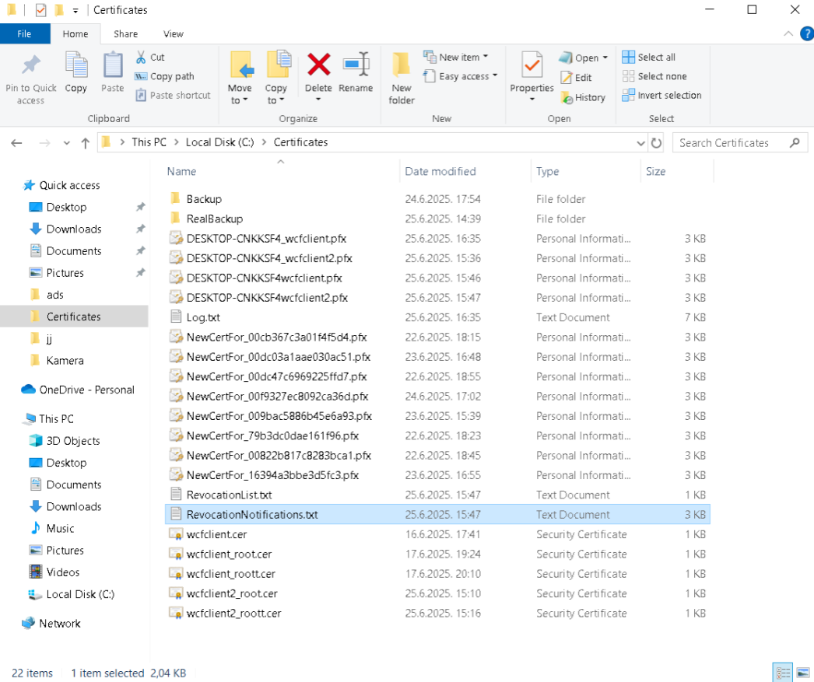
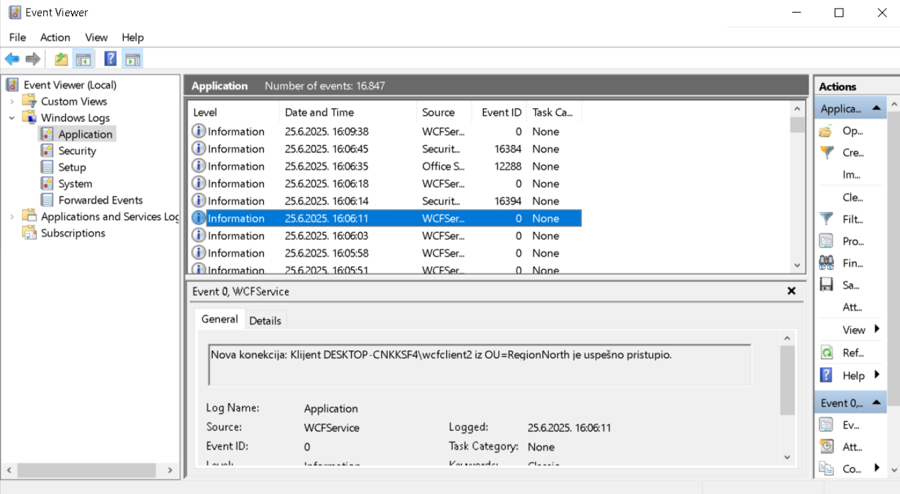

# 🛡️ Certificate Management System (CMS)

Ovaj projekat implementira komponentu za upravljanje sertifikatima i bezbednu komunikaciju između više WCF servisa i klijenata, koristeći digitalne sertifikate i Windows Event Log za praćenje aktivnosti.

## 📌 Ključne funkcionalnosti

✅ Kreiranje sertifikata (sa i bez privatnog ključa)  
✅ Povlačenje kompromitovanih sertifikata i njihovo automatsko obnavljanje  
✅ Evidencija nevažećih sertifikata u `RevocationList.txt`  
✅ Obaveštavanje o revokaciji (`RevocationNotifications.txt`)  
✅ Replikacija fajlova na `BackupService`  
✅ Komunikacija klijenata putem WCF-a uz autentifikaciju sertifikatom (ChainTrust)  
✅ Periodično javljanje klijenta ukoliko pripada dozvoljenoj grupi  
✅ Logovanje u **Windows Event Log**:
- uspostavljanje veze
- prekid veze
- greške i revokacije  

## ⚙️ Pre pokretanja sistema

### 1. Sertifikati

- Sertifikati se instaliraju u `Local Machine` za svaki entitet (`wcfclient`, `wcfclient2`, `wcfservice`)
- Sertifikati treba da se nalaze u sledećim sekcijama:
  - **Personal (My)**
  - **Trusted People**
  - **Trusted Root Certification Authorities**

📸 *Primer izgleda:*

  
  

### 2. Korisničke grupe i prava

- Klijenti moraju biti članovi jedne od sledećih grupa:
  - `RegionEast`, `RegionWest`, `RegionNorth`, `RegionSouth`
- Takođe, svi korisnici i servisi moraju biti u **Administrators** grupi:

📸 *Primer podešavanja:*

> Kada se doda novi korisnik, potrebno je da se korisnik prijavi bar jednom kako bi se grupa primenila.

## ▶️ Pokretanje programa

### Redosled:

1. `BackupService.exe`
2. `CertificateManagerService.exe`
3. `WCFService.exe`
4. `Client.exe`

### Način pokretanja

1. Idi u `bin\Debug` folder svake komponente
2. Pokreni svaku `.exe` aplikaciju **desnim klikom → Run as administrator**
3. Ako koristiš različite korisnike za klijente, koristi `Shift + desni klik → Run as different user`(takođe i wcfservice treba da se pokrene kao wcfservice user)

## 📁 Fajlovi koji se generišu

Svi važni fajlovi se čuvaju u folderu `C:\Certificates`:

- `*.pfx` sertifikati
- `Log.txt` – log aktivnosti klijenata
- `RevocationList.txt` – lista povučenih sertifikata
- `RevocationNotifications.txt` – beleške o obaveštenju klijentima
- `RealBackup/` – podaci replikovani sa `CertificateManagerService`

📸 *Primer:*

## 📄 Windows Event Log

Logovanje aktivnosti se obavlja u `Application` delu Event Viewera.

📸 *Primer loga:*

## 🎮 Meni u klijentskoj aplikaciji

Klijent nudi sledeće opcije:

- Kreiraj sertifikat
- Povuci (revoke) sertifikat
- Auto provera i automatska revokacija
- Pokreni periodičnu komunikaciju
- Izlaz
